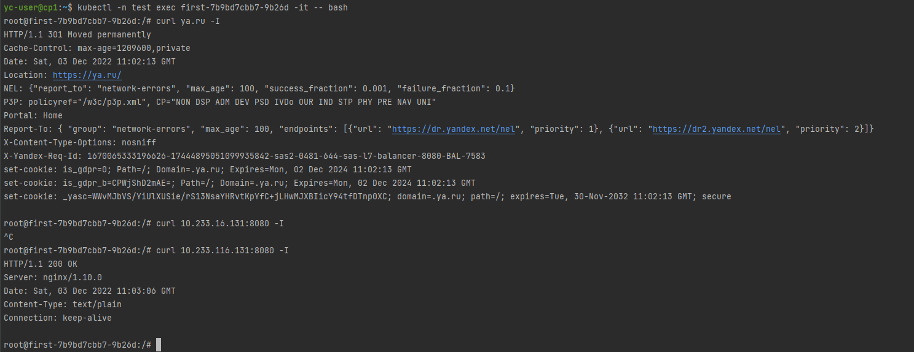

# Домашнее задание к занятию "14.5 SecurityContext, NetworkPolicies"

## Задача 1: Рассмотрите пример 14.5/example-security-context.yml

Создайте модуль

```
kubectl apply -f 14.5/example-security-context.yml
```

Проверьте установленные настройки внутри контейнера

```
kubectl logs security-context-demo
uid=1000 gid=3000 groups=3000
```

#### Ответ:


## Задача 2 (*): Рассмотрите пример 14.5/example-network-policy.yml

Создайте два модуля. Для первого модуля разрешите доступ к внешнему миру
и ко второму контейнеру. Для второго модуля разрешите связь только с
первым контейнером. Проверьте корректность настроек.

### Ответ:

[Все манифесты](14.5/test_ex) 

Сделал 2 приложения, [first](14.5/test_ex/first.yaml) и [second](14.5/test_ex/second.yaml), сервисы к ним - [services](14.5/test_ex/services.yaml), политики - [politics](14.5/test_ex/polices.yaml).
В итоге если пробовать зайти в под, то доступ есть и с первого приложения и со второго


Разобрался:

Не работает в миникубе, в облаке доступ правильный:



---

### Как оформить ДЗ?

Выполненное домашнее задание пришлите ссылкой на .md-файл в вашем репозитории.

В качестве решения прикрепите к ДЗ конфиг файлы для деплоя. Прикрепите скриншоты вывода команды kubectl со списком запущенных объектов каждого типа (pods, deployments, statefulset, service) или скриншот из самого Kubernetes, что сервисы подняты и работают, а также вывод из CLI.

---
